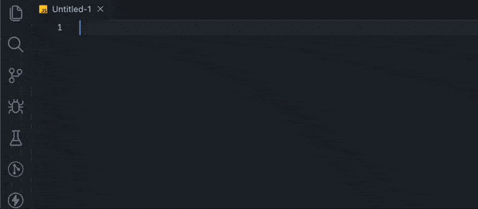

<p align="center">
    <p align="center">
        
    </p>
    <h1 align="center"><b>FTOS SDK Code Snippets</b></h1>
    <br />
    <br />
    <p align="center">
        
    </p>
</p>

## Installation

1. Launch _Quick Open_:

   - Linux & Windows: `Ctrl+P`
   - macOS: `⌘+P`

2. Paste the following command and press `Enter`:

```shell
ext install ftos-snippets-vscode
```

3. Choose the extension (make sure the author is `Andrei Radu`).

4. Reload Visual Studio Code

## Usage

Every Code SDK snippet starts with the "ftos:" prefix:

- ftos:server:fetchquery
- ftos:monitoring:highCPU

Each snippet is divided into categories as follows:

- server (snippets from Server SDK)
- client (snippets from Client SDK)
- monitoring (snippets from CS Monitoring )

## Snippets

| Keyword                                 | Description                                      |
| --------------------------------------- | ------------------------------------------------ |
| ftos:server:importlib                   | import and cache a server library                |
| ftos:server:fetchquery                  | Server Fluent Query Snippet                      |
| ftos:server:fluentquery                 | Server Fluent Query Snippet                      |
| ftos:server:fluentqueryTop              | Server Fluent Query Snippet                      |
| ftos:server:fluentqueryLeftJoin         | Server Fluent Query Left Snippet                 |
| ftos:server:fluentqueryInnerJoin        | Server Fluent Query Left Snippet                 |
| ftos:monitoring:frequentlyRunnedQueries | FTOS Frequently Runned Queries Plan              |
| ftos:monitoring:highCPU                 | FTOS High CPU Queries Plan                       |
| ftos:monitoring:highDiskReading         | FTOS High Disk Reading Queries Plan              |
| ftos:monitoring:longRunningQueries      | FTOS Long Running Queries Plan                   |
| ftos:monitoring:spoWho3                 | FTOS SP_WHO V3                                   |
| ftos:monitoring:worstSQL                | FTOS Worst SQL                                   |
| ftos:monitoring:deadlocks               | TODO: Returns the deadlocks identifier procedure |
| ftos:monitoring:lockchain               | TODO: Returns the lockchain identifier procedure |

## Feedback and issues

If you encounter any issues or have feedback, please open an issue on
the [GitHub repository](https://github.com/aandreiradu/ftos-snippets-vscode/issues). We appreciate your feedback
and contributions!

## License

This project is licensed under the MIT License - see the [LICENSE](./LICENSE) file for details.
